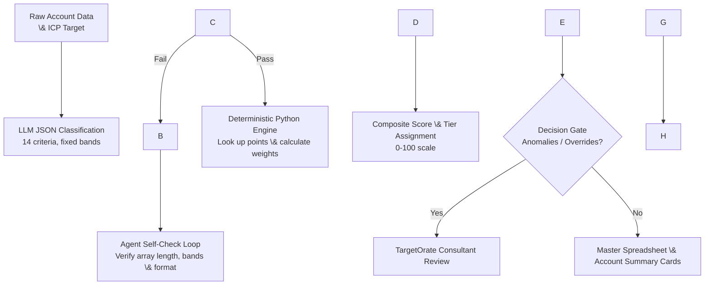

# FIOR Account Scoring Workflow (MVP Platform Architecture)

2026-09-28 · Team Gamma (Auburn University MBA Capstone)

## Purpose

This workflow turns qualitative and quantitative account data into a repeatable, automated FIOR account score. Updated for Week 5 MVP platform execution, this architecture consolidates our approach based on TargetOrate's feedback: **the LLM is strictly restricted to classifying account data against fixed rubric bands (JSON output), while all mathematical calculations (weighted roll-ups, 0-100 composite scores, and tier allocations) are executed deterministically in Python code.**

This eliminates the ranking instability and math drift observed in earlier manual runs, ensuring identical scores across repeated executions.

## Inputs and Outputs

1. **ICP Target Definition** - The validated target profile criteria.
2. **Candidate Account Profile Dataset** - Rich qualitative and quantitative account records (`CloudBridge\_20\_Company\_Dataset\_Week5\_MVP.csv`), now including ICP-qualified, weak-fit (`Partial`), and hard-disqualified (`N`) examples.

**Output:** A fully validated portfolio snapshot and standardized Account Summary Cards driven by deterministic code math.

## Workflow Steps \& Self-Check Architecture



## Deterministic Scoring Rubric

All criteria use a 4-band fixed scale (10/7/4/1) except Annual Contract Value (ACV), which uses dedicated monetary bands (10/8/6/4/1).

### FIT (35% Weight)

* **Industry/Segment Match:** 10 (Exact match), 7 (Industry match, sub-industry differs), 4 (Adjacent industry), 1 (Outside target).
* **Company Size:** 10 (Revenue \& employees in range), 7 (One in range), 4 (Same order of magnitude), 1 (Out of range / no data).
* **Technology Stack:** 10 (Fully compatible), 7 (Mostly compatible), 4 (Legacy/missing integration), 1 (Incompatible / no data).
* **Geography/Compliance Ready:** 10 (Target geo \& compliance met), 7 (Target geo, compliance unknown), 4 (Outside geo, compliance met), 1 (Outside geo, compliance unmet).

### INTENT (25% Weight)

* **Intent Signals \& Research Behavior:** 10 (3+ signals in 30 days), 7 (1-2 signals in 30-90 days), 4 (Undated / >90 days), 1 (No signals).
* **Buying Triggers \& Trigger Events:** 10 (Named trigger in 90 days), 7 (Trigger identified, timing unclear), 4 (General pattern), 1 (No trigger).
* **Decision Timeline \& Buying Readiness:** 10 (Active buying cycle), 7 (Near-term timeline), 4 (Long-term timeline), 1 (Unclear / no timeline).
* **Competitive Context \& Urgency:** 10 (No competitor), 7 (Dissatisfied incumbent / displacement opportunity), 4 (Renewal upcoming), 1 (Locked competitor).

### OPPORTUNITY (30% Weight)

* **Annual Contract Value (ACV):** 10 (>$500K), 8 ($250K-$500K), 6 ($100K-$250K), 4 (<$100K), 1 (Unknown).
* **Expansion Potential:** 10 (Multi-product fit, 2+ paths), 7 (One upsell path), 4 (Land-and-expand unconfirmed), 1 (No path).
* **Strategic Value:** 10 (Market leader \& referenceable), 7 (Leader or referenceable), 4 (Partnership potential), 1 (No strategic value).
* **Win Probability:** 10 (Budget confirmed, favorable), 7 (Budget likely, neutral), 4 (Budget unconfirmed), 1 (No budget / unfavorable).

### RELATIONSHIP (10% Weight)

* **Existing Connections:** 10 (Exec relationship / warm intro), 7 (Mid-level contact), 4 (Indirect connection), 1 (No connections).
* **Engagement History:** 10 (Former customer / active champion), 7 (Past engagement in 12 mos), 4 (Minimal engagement), 1 (No history).

## Weighted Score Calculation \& Tier Assignment

Executed in Python code (`scripts/fior\_scoring\_engine.py`):

* **Fit:** Dimension Average $	imes 3.5$ (/35)
* **Intent:** Dimension Average $	imes 2.5$ (/25)
* **Opportunity:** Dimension Average $	imes 3.0$ (/30)
* **Relationship:** Dimension Average $	imes 1.0$ (/10)
* **Total Composite Score:** Sum of weighted dimensions (/100)

**ABM Tiers:**

* **Tier 1 (80–100):** 1:1 ABM ($50K-$100K+ Investment)
* **Tier 2 (60–79):** 1:Few ABM ($10K-$25K Investment)
* **Tier 3 (40–59):** 1:Many ABM ($1K-$5K Investment)
* **Nurture / Disqualify (<40):** Inbound Only

## Week 5 MVP Platform Execution \& Self-Check Prompt

```markdown
Role: Expert B2B GTM Strategy Consultant \& Account-Scoring Classification Engine within the TargetPath Framework.

Context \& Instructions:
1. Score every account INDEPENDENTLY against the fixed SCORING BANDS. Never invent scores outside the listed bands.
2. If an account's profile lacks data for a criterion, choose its lowest band and set "data\_available": false.
3. SELF-CHECK REQUIREMENT: Before outputting the final JSON array, perform an internal validation check:
   - Verify that all 14 criteria are present for every account.
   - Confirm that every chosen band is copied verbatim from the rubric.
   - Check that account array length matches the input count. If errors are found, correct them internally.
4. Output ONLY a valid JSON array containing classifications, points, and evidence.
```

