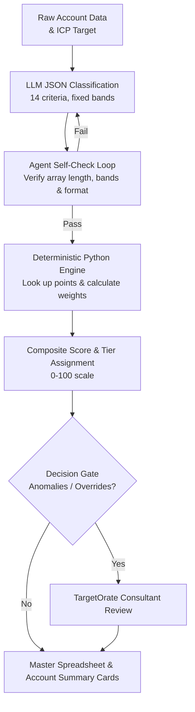

# FIOR Account Scoring Workflow (MVP Platform Architecture)

2026-09-28 · Team Gamma (Auburn University MBA Capstone Project)

## Purpose

This workflow turns a filled-out ICP Template into a repeatable FIOR account score. Updated for Week 5 MVP platform execution based on TargetOrate's feedback, this architecture consolidates our approach: **the LLM is strictly restricted to classifying account data against fixed rubric bands (JSON output), while all mathematical calculations (weighted roll-ups, 0-100 composite scores, and tier allocations) are executed deterministically in Python code.** 

This eliminates the ranking instability and math drift observed in earlier manual runs, ensuring identical scores across repeated executions.

## Inputs and Outputs

The FIOR framework scores one specific candidate account. The ICP Template defines the target profile, not a specific candidate account's actual attributes. So this workflow needs two inputs:

1. **ICP Target Definition** - the ICP Template filled out for the client's ideal profile(s), used as the reference range/values to compare a candidate against.
2. **Candidate Account Profile** - the same template's field categories, filled out with one real (or test) company's actual data (`CloudBridge_20_Company_Dataset_Week5_MVP.csv`), including qualified, weak-fit (`Partial`), and hard-disqualified (`N`) examples.

**Output:** a completed FIOR Account Summary Card - the 4 dimension scores, the weighted total (/100), the tier assignment, and a short strengths/gaps/recommended-action narrative driven by deterministic code math.

## Workflow Steps & Self-Check Architecture



The split between step B (LLM classifies each criterion into a fixed category) and step D (Python code computes the numeric score from that category) is the main lever for repeatability: the LLM never does arithmetic, and it never picks a number freely from 1-10. It only chooses which pre-written description best matches the evidence.

## Field Mapping: ICP Template to FIOR Criteria

| FIOR Criterion | Dimension | ICP Template Field(s) | Coverage |
| --- | --- | --- | --- |
| Industry/Segment Match | FIT | Industry (row 8), Sub-industries (row 9) | Full |
| Company Size | FIT | Company Size/Employee Count (row 10), Annual Revenue (row 12) | Full |
| Technology Stack | FIT | Digital Footprint (row 16), Other tech requirements (row 17), Technology Maturity (row 21), Integration Requirements (row 22) | Full |
| Geography/Compliance Ready | FIT | Geography/Location (row 11) | Partial - no explicit compliance/security field |
| Intent Signals & Research Behavior | INTENT | Intent Signals (row 27) | Full, but undated |
| Buying Triggers & Trigger Events | INTENT | Buying Triggers (row 24), Trigger Events (row 28) | Full, but undated |
| Decision Timeline & Buying Readiness | INTENT | None | **Gap** |
| Competitive Context & Urgency | INTENT | Competitive context (row 18) | Partial - no renewal timing field |
| Annual Contract Value | OPPORTUNITY | None (revenue rows describe the account's own size, not deal value) | **Gap** |
| Expansion Potential | OPPORTUNITY | None | **Gap** |
| Strategic Value | OPPORTUNITY | Why would they choose us (row 26, partial) | Partial |
| Win Probability | OPPORTUNITY | None | **Gap** |
| Existing Connections | RELATIONSHIP | Champion(s) (row 29), Primary Decision Maker (row 30), Influencer(s) (row 31) | Partial - no relationship-warmth or seniority indicator |
| Engagement History | RELATIONSHIP | Contact availability (row 34) | Partial - no history/recency field |

## Deterministic Scoring Rubric

All criteria use a 4-band scale (10/7/4/1) except Annual Contract Value (ACV), which uses dedicated monetary bands (10/8/6/4/1).

### FIT (35%)
| Criterion | 10 | 7 | 4 | 1 |
| --- | --- | --- | --- | --- |
| Industry/Segment Match | Industry + sub-industry both match ICP target | Industry matches; sub-industry differs/unlisted | Adjacent industry (client-defined adjacency list) | Outside target, not adjacent |
| Company Size | Revenue and employees both within ICP range | One of the two within range | Both outside range, same order of magnitude | Both outside range by >1 order of magnitude, or no data |
| Technology Stack | Stack/integrations fully compatible; maturity meets or exceeds requirement | Mostly compatible; one gap or one maturity tier below | Multiple required integrations missing or legacy stack | Incompatible or no tech data |
| Geography/Compliance Ready | In target geography; compliance/security requirements confirmed met | In target geography; compliance status unknown | Outside target geography; compliance met | Outside target geography; compliance unmet/unknown |

### INTENT (25%)
| Criterion | 10 | 7 | 4 | 1 |
| --- | --- | --- | --- | --- |
| Intent Signals & Research Behavior | 3+ documented signals within last 30 days | 1-2 signals within last 30-90 days | Signals noted but undated or >90 days old | No signals recorded |
| Buying Triggers & Trigger Events | Named trigger event within last 90 days | Trigger identified, timing unclear or >90 days | General trigger pattern noted, no specific event | No trigger identified |
| Decision Timeline & Buying Readiness | Active buying cycle | Near-term timeline | Long-term timeline | Unclear timeline / no timeline stated |
| Competitive Context & Urgency | No competitor in place | Dissatisfied with current competitor (displacement opportunity) | Contract renewal with competitor upcoming (incumbent still in place) | Contract locked with competitor (no near-term opportunity) |

### OPPORTUNITY (30%)
| Criterion | 10 | 8 | 6 | 4 | 1 |
| --- | --- | --- | --- | --- | --- |
| Annual Contract Value | >$500K | $250K-$500K | $100K-$250K | <$100K | Unknown/not estimated |

| Criterion | 10 | 7 | 4 | 1 |
| --- | --- | --- | --- | --- |
| Expansion Potential | Multi-product fit, 2+ upsell paths identified | One upsell opportunity identified | Land-and-expand possible, unconfirmed | No expansion path identified |
| Strategic Value | Market leader AND referenceable | Market leader OR referenceable | Neither, but partnership/co-marketing potential | No strategic value beyond the deal |
| Win Probability | Budget confirmed, favorable position, comparable wins | Budget likely, neutral position | Budget unconfirmed, unclear position | No budget or unfavorable position |

### RELATIONSHIP (10%)
| Criterion | 10 | 7 | 4 | 1 |
| --- | --- | --- | --- | --- |
| Existing Connections | Executive-level relationship or confirmed warm intro | Mid-level contact or mutual connection, no exec access | Connection identified but unconfirmed/indirect | No known connections |
| Engagement History | Former customer, or champion in active dialogue | Past engagement (event/demo/call) within 12 months | Minimal engagement (form fill, email open) only | No engagement history |

## Weighted Score Calculation and Tier Assignment

Executed deterministically in Python (`scripts/fior_scoring_engine.py`):
- **Fit:** Dimension Average $	imes 3.5$ (/35)
- **Intent:** Dimension Average $	imes 2.5$ (/25)
- **Opportunity:** Dimension Average $	imes 3.0$ (/30)
- **Relationship:** Dimension Average $	imes 1.0$ (/10)
- **Total Composite Score:** Sum of weighted dimensions (/100)

| Total Score | Tier | ABM Approach | Investment Level |
| --- | --- | --- | --- |
| 80-100 | Tier 1 | 1:1 ABM | $50K-$100K+ per account |
| 60-79 | Tier 2 | 1:Few ABM | $10K-$25K per account |
| 40-59 | Tier 3 | 1:Many ABM | $1K-$5K per account |
| <40 | Nurture/Disqualify | Inbound Only | Minimal investment |

## Concerns and Open Questions

1. **OPPORTUNITY dimension is largely unsupported by the ICP Template.** 3 of its 4 criteria lack direct source fields.
2. **The ICP Template defines the target profile, not a candidate account.** Each candidate requires its own profile intake.
3. **INTENT timing gaps.** Timestamps and buying readiness require careful operational tracking.
4. **Qualitative criteria definitions.** Need client alignment on adjacency, compliance thresholds, and relationship warmth.
5. **Disqualification short-circuit.** Hard disqualifiers (`ICP Qualified = N`) route straight to Nurture.
6. **Missing-data handling.** Unscored criteria default to the lowest band.
7. **Rounding convention.** Round half-up to 1 decimal place on dimension averages before weighting.
8. **Real test set insights.** Testing against the 20-company MVP dataset validated that separating classification from Python math successfully resolved ranking instability.

## Implementation Steps & Ready-to-Use Prompt

1. Lock intake format and test dataset (`CloudBridge_20_Company_Dataset_Week5_MVP.csv`).
2. Run LLM JSON classification prompt with built-in Agent Self-Check Loop.
3. Execute deterministic Python scoring engine (`fior_scoring_engine.py`).
4. Validate low-confidence flags and review output against ABM Tiers.

```markdown
Role: Expert B2B GTM Strategy Consultant & Account-Scoring Classification Engine.

Context & Instructions:
1. Score every account INDEPENDENTLY against the fixed SCORING BANDS. Never invent scores outside the listed bands.
2. If an account's profile lacks data for a criterion, choose its lowest band and set "data_available": false.
3. SELF-CHECK REQUIREMENT: Before outputting the final JSON array, perform an internal validation check:
   - Verify that all 14 criteria are present for every account.
   - Confirm that every chosen band is copied verbatim from the rubric.
   - Check that account array length matches the input count. If errors are found, correct them internally.
4. Output ONLY a valid JSON array containing classifications, points, and evidence.
```
